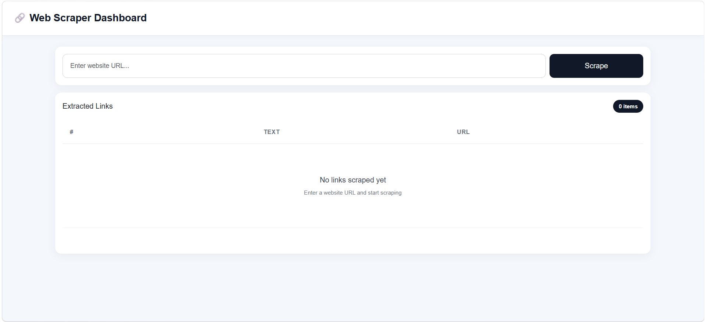
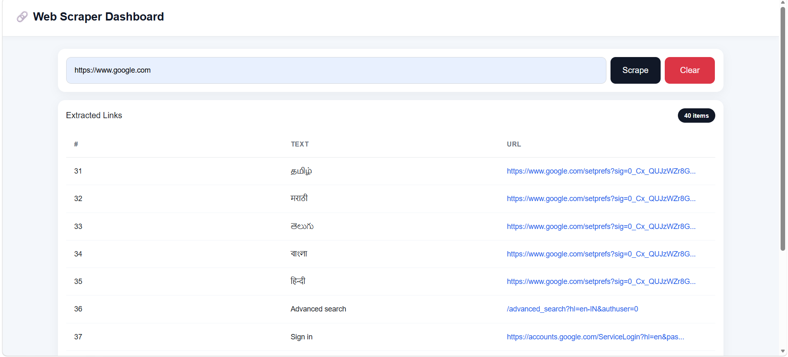

<div align="center">

# 🔗 Web Link Scraper

### Extract all links from any webpage instantly

A modern web-based scraper built with Django that allows users to paste any website URL and instantly extract all `<a>` tag links present on that page.

<br>



<br>


</div>

---

# ✨ Features

✅ Extract all `<a>` tag links from any webpage  
✅ Clean and responsive UI  
✅ Fast scraping performance  
✅ Internal & external link extraction  
✅ Copy extracted links instantly  
✅ User-friendly dashboard  
✅ Mobile responsive design  
✅ Simple and lightweight architecture  

---

# 📸 Screenshots

---

## 🏠 Home Page


---

## 🔎 Extracted Links Result



---

## 🔎 Invalid Links Error


---

# 🚀 How It Works

1. Enter any website URL
2. Click on **Extract Links**
3. The scraper fetches webpage HTML
4. All `<a>` tag links are extracted
5. Results are displayed instantly

---

# 🛠️ Tech Stack

| Technology | Usage |
|------------|-------|
| Python | Backend Logic |
| Django | Web Framework |
| BeautifulSoup | HTML Parsing |
| Requests | HTTP Requests |
| HTML/CSS | Frontend |
| JavaScript / jQuery | Dynamic UI |

---

# 📂 Project Structure

```bash
scrapper/
│
├── core/
├── link/
├── scrapper/
├── screenshots/
├── .env.example/
├── .gitignore/
├── manage.py
├── README.md
├── requirements.txt/